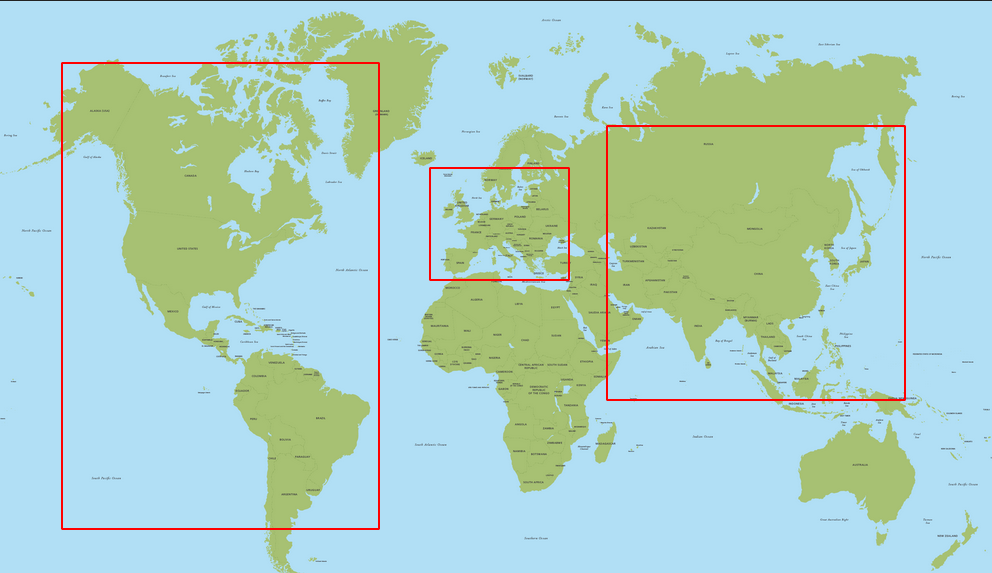

# whyem-etl


[](https://circleci.com/gh/miyeung/whyem-etl)
[](https://codecov.io/gh/miyeung/whyem-etl)
[](https://github.com/psf/black)

## Description

whyem-etl is the pet project I use as a sandbox for experimentation and
learning. Therefore should not be used in production. It consists in a Python
webserver that provides APIs to get various information from a dataset
containing job applications information.

The current APIs allows to:

- Enrich the data in an ETL fashion
- Get aggregated data.

In term of toolings, the project comes with:

- Application packaging (pipenv)
- Code quality checks
  - Linter (flake8)
  - Formatter (black)
  - Vulnerabilities in dependencies and code (pipenv / bandit)
  - Automated unit testing (pytest)
- Local deployment using docker and docker-compose
- Continuous Integration (CI) using CircleCI running the above code quality checks.

Provided APIs are:

| Type | Name               | Port | Description                                                                         |
| ---- | ------------------ | ---- | ----------------------------------------------------------------------------------- |
| POST | /jobsByContinent   | 5000 | Returns the aggregated jobs information by continent given the profession_ids.      |
| GET  | /consolidateData   | 5000 | Consolidates the jobs data by adding the Continent information in an ETL fashion.   |
| GET  | /checkDbConnection | 5000 | Check connectivity between web server database by returning first row of jobs data. |
| GET  | /                  | 5000 | Check connectivity with web server.                                                 |

## Getting started

### Prerequisites

This application requires installing:

- Python 3.7
- Docker
- Docker-compose

### Getting Python dependencies

Once the above tools installed, run the following commands. It will install
Python dependencies.

```bash
# Init Python environment with pipenv
make init
```

### Run webserver and database

To run the webserver and its Postgres database, run the following:

```bash
# Build docker image
make docker-image

# Run webserver and its database with docker-compose
make compose-up
```

It will create a docker image for the Python webserver and pulls a Postgres
database image. Once generated and downloaded, they will be run as containers
within a virtual network, and connected altogether. Mocked data located in
`./data/dump.sql` will automatically be loaded in the database.

### Check connectivity with webserver

```bash
curl http://127.0.0.1:5000/
# Hello, World!
```

### Check webserver connectivity with database

```bash
curl http://127.0.0.1:5000/checkDbConnection
```

The response should be the first row in database:

```json
{
    "candidates":2,
    "job_reference":"00008062b54689de44d78b240fff3b89",
    "office_continent":"europe",
    "office_latitude":48.8669091,
    "office_longitude":2.3505013,
    "organization_reference":"1e9bd0d26870a3962298751941adc09a",
    "profession_id":15
}
```

### Add continent information to data

In the original data, the continent information is not provided. To tackle this
issue, an `office_continent` column has been added to the table and the
`/consolidateData` implemented.

`/consolidateData` works in an ETL fashion: it extracts the data from a
database, transforms it by adding the continent information and loads it back.
It can takes a few minutes to be run.

```bash
curl http://127.0.0.1:5000/consolidateData
```

This API is yet to be improved on how continent information is derived given
(latitude, longitude). As of today, the API:

- add continent labels for `EUROPE`, `ASIA` and `AMERICA`
- for rows that could not be labeled, `OTHERS` is added
- has a success rate of 98.23% (475 rows with `OTHERS` among 26873 total rows).

For data quality evaluation and future improvements, the API response contains
the success rate and the failed rows references. See example below:

```json
{
    "consolidation_success_rate": 98.23242659918877,
    "failed_rows": [
        "0069be0f45bf177a85fcb8300cece198",
        "00963dc1881f268931a39e517ddd7580",
        "00d70de33e4eb465d90c94758e22c2c8",
        "01268e220faeec583b1da2b21134b2d7",
        "012a0b12eda34452467fae4bdbe6ca9e",
        "023e96ef31fbfea30c6044b8997ece74",
        "02411b211404ee28ba6b203f10050822",
        "02706b187a03ca3a7f2780bcefb1ace2",
        "..."
    ]
}
```

### Get jobs information by continent

To get the total number of job offers aggregated by continent for a given list
of professions, we use the `/jobsByContinent` API. See below example usage for
profession_id 12 and 15.

```bash
# Getting information for profession_id = 12 and 15
curl --header "Content-Type: application/json" \
    --request POST \
    --data '{"profession_ids": [12,15]}' \
    http://127.0.0.1:5000/jobsByContinent
```

See below the response.

```json
{
    "AMERICA": 167,
    "ASIA": 5,
    "EUROPE": 35613,
    "OTHERS": 149
}
```

Note that the API provides also provides the number of job offers on
unidentified continents.

## Tooling

```bash
# ---------------------------------------------------------------------
# Application building
# ---------------------------------------------------------------------

# Set up pipenv project, dependencies and install pre-commit
make init

# Syntax check with Flake8 linter
make flake8

# Codestyle check with Black formatter
make black

# Security dependencies check with Pipenv
make check-deps

# Security code check with Bandit
make bandit

# Run Python tests
make test

# ---------------------------------------------------------------------
# Local deployment and basic monitoring
# ---------------------------------------------------------------------

# Build docker image
make docker-image

# Run webserver and postgres db with docker-compose
make compose-up

# Check webserver logs
docker logs whyemetl_server

# Check db logs
docker logs whyemetl_db

# Connect to db for interactive SQL
docker exec -it whyemetl_db bash
psql -U postgres

# Stop docker-compose
make compose-stop

# Run off docker-compose containers
make compose-down
```

## Case study: Getting relevant information from open job positions data

### Dataset description

The dataset used here is stored under `data/dump.sql` that is an extract of a
Postgres database. The dump is automatically loaded when running both server and
database with docker-compose.

There are 2 tables:

- `jobs` that contains all the open job positions information. They comes from
  different companies. It is the fact table.
- `professions` that contains a list of professions that are associated to an
  open job positions. It is a dimension table.

From an analytics perspective, it is relevant to get statistics on the data such
as the distribution of professions by jobs or the repartition of number of open
positions by continent. As of today, the developped APIs focus on the latter use
case.

### Design considerations to get the number of jobs by continent

The data contains position information (latitude, longitude) of the offices
related to the open positions. Because the main `/jobsByContinent` relies on the
Continent information, it needed to be added in some way.

The first idea that came up was to integrate the PostGIS plugin that comes up
with multiple geospatial features on top of Postgres. While this idea sounded
promising, I was unsure the Continent column could be added easily. A Continent
can represented by a list of positions that would form a polygon. This
representation raised several questions such as:

- `how many points to take?`
- `who define what are the continent delimitations?`
- `where to get such data?`

Because both of these questions are non-trivial and more generally GIS is
complex, I decided not to take this approach. Moreover, in the future I might
want to deploy in a Cloud platform. Not all of their services contain an
out-of-the-box integration with PostGIS.

The second approach was to construct the Continent information dynamically for
every API call. While easier, I needed to find a way to get such information
given (latitude, longitude). Such information could be retrieved from the rich
Google Geolocation API. The downsides to this solution is that it would add a
high-adherence to an external service on which we do not have control and is
costly.

Both of these solutions seemed over-engineered and came with too many
drawbacks. Based on the assumption that job offices are very likely to be in
large capital cities, the final approach that was implemented is a mix of
static/dynamic information transformation:

- Approximate continents by Rectangle shapes roughly surrounding them
- Develop internal APIs to process the Continent information
- Add the information on existing information when starting the db (static
  transformations)
- Add the information dynamically when putting new data (not implemented).

See illustration below:



This far more easier solution has good results:

- Only a few minutes is needed to process the data at rest when starting the database
- Most of the processing is done on the database side
- Developers can use SQL-like (filter, group by...) to get the right information
  instead of doing ad-hoc transformations in Python
- Total control on the transformation code
- Ease of maintenance using interfaces.

The major downside to this approach is the data quality issue. Considering
continents as rectangles (that can not be pivoted) is a raw approximation: the
rectangles will never match the boundaries of continents.

By adding the success_rate, it helped be to know if many rows were not labeled
or not. However, it does not solve the issue of low-quality rectangle
approximation. To improve the data quality, I would favor an iterative approach:

- Visualize a scatter-plotting of positions using Jupyter and Matplolib to check
  the rectangles
- Refine the rectangles positions and size.
- When rectangles is not precise enough, it might be interesting to try another shape.
